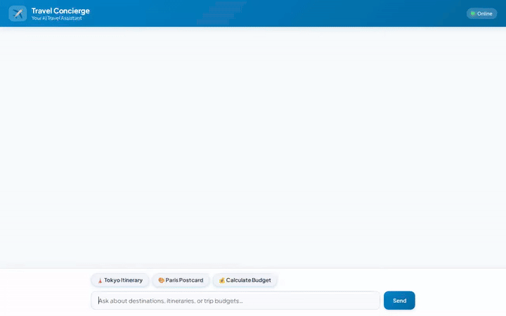

# Travel Concierge Agent

An intelligent, AI-powered travel assistant built on Google's **Agent Development Kit (ADK)** and deployed on **Vertex AI Agent Engine**. The agent provides personalized itinerary planning, destination discovery, budget estimation, interactive maps, generated destination imagery, and short promotional videos.



---

## 🌟 Key Features & Tool Integrations

Grounded directly in the codebase (`app/agent.py` and `agents-cli-manifest.yaml`), the agent utilizes the following services and tools:

- **🧠 Vertex AI Memory Bank**: Integrates `PreloadMemoryTool` to persist and retrieve long-term user preferences, past travel interests, and budget constraints across sessions.
- **📚 Cloud Firestore Catalog**: Queries destination information (`search_destinations`) and calculates itemized travel cost estimates (`estimate_budget`) based on duration and traveler count.
- **🎨 Imagen 3 Image Generation**: Uses `imagen-3.0-generate-002` (`generate_destination_image`) to synthesize custom postcards and destination photos, registering artifacts via `tool_context.save_artifact` and uploading to Google Cloud Storage.
- **🎬 Gemini Omni Video Generation**: Uses `gemini-omni-flash-preview` via the Vertex AI Interactions API (`generate_destination_video`) to create short 720p promotional videos, saving local artifacts and uploading MP4 files to Cloud Storage.
- **☁️ Google Cloud Storage**: Stores generated media assets in a dedicated public GCS bucket (`travel-concierge-media-qwiklabs-gcp-02-9a8a47b644e5`) and returns accessible public HTTPS URLs.
- **🗺️ Google Maps Static API**: Fetches static satellite and roadmap imagery for travel spots (`get_destination_map`).
- **🎴 Native A2UI Display Cards**: Emits structured Agent-to-UI (A2UI) card payloads rendered cleanly in the chat interface.

> **Note on Feature Status:** Live external flight booking APIs and active voice speech-to-text integration were planned in initial designs but are *not yet implemented* in the current codebase.

---

## 🏗️ Architecture

```
                               ┌──────────────────────────────────┐
                               │     FastAPI Chat Proxy           │
                               │   (frontend/main.py + A2UI)      │
                               └────────────────┬─────────────────┘
                                                │ (A2A Protocol)
                                                ▼
                               ┌──────────────────────────────────┐
                               │   Vertex AI Agent Engine (ADK)   │
                               │           (app/agent.py)         │
                               └────────────────┬─────────────────┘
                                                │
       ┌──────────────────┬─────────────────────┼─────────────────────┬──────────────────┐
       │                  │                     │                     │                  │
       ▼                  ▼                     ▼                     ▼                  ▼
┌──────────────┐   ┌──────────────┐    ┌─────────────────┐   ┌─────────────────┐  ┌──────────────┐
│ Memory Bank  │   │  Firestore   │    │  GCS Bucket     │   │    Imagen 3     │  │ Gemini Omni  │
│ (User State) │   │ (Catalog DB) │    │  (Media Host)   │   │(Image Synthesis)│  │(Video Gen)   │
└──────────────┘   └──────────────┘    └─────────────────┘   └─────────────────┘  └──────────────┘
```

---

## 🛠️ Local Development & Setup

### Prerequisites

- Python 3.10+
- Node.js 18+ (for Playwright demo recorder)
- Google Cloud SDK (`gcloud`) authorized with your project credentials

### 1. Install Agent Dependencies

```bash
pip install -r requirements.txt
```

### 2. Run the Agent Locally with ADK

To test the agent using the ADK Development Web UI:

```bash
adk web --port 8000
```

### 3. Run the Custom FastAPI Chat Frontend

To start the custom chat proxy and web interface locally:

```bash
cd frontend
pip install -r requirements.txt

# Set environment variables (or let frontend auto-detect from deployment_metadata.json)
export AGENT_ENGINE_RESOURCE_NAME="projects/<PROJECT_NUMBER>/locations/<REGION>/reasoningEngines/<ENGINE_ID>"
export AGENT_DIRECTORY="app"

python main.py
```

Open your browser to `http://localhost:8080` to interact with the Travel Concierge frontend.

---

## 📹 Recording Demo Videos

You can run the Playwright screen recording tool to capture a demo video of the agent:

```bash
# Record a standard demo
node .agents/skills/record-demo/record-agent.js \
  -u http://localhost:8080 \
  -q "What top destinations do you recommend in Japan?" \
  -q "Generate a postcard image of Kyoto" \
  -o agent_demo.webm

# Record with 1.5x speedup and upbeat lo-fi background music (via Google Lyria)
node .agents/skills/record-demo/record-agent.js \
  -u http://localhost:8080 \
  -q "Find top cultural destinations in Japan and calculate a 5-day budget for 2 travelers." \
  -q "Generate a vibrant postcard image of Kyoto with cherry blossoms and ancient temples." \
  --wait 30000 \
  --speed 1.5 \
  --music "upbeat lo-fi chill hip-hop, mellow Rhodes piano, soft vinyl crackle, relaxed downtempo travel beat" \
  -o travel_concierge_lofi_demo.webm
```

---

## 📜 License

Distributed under the Apache 2.0 License.
